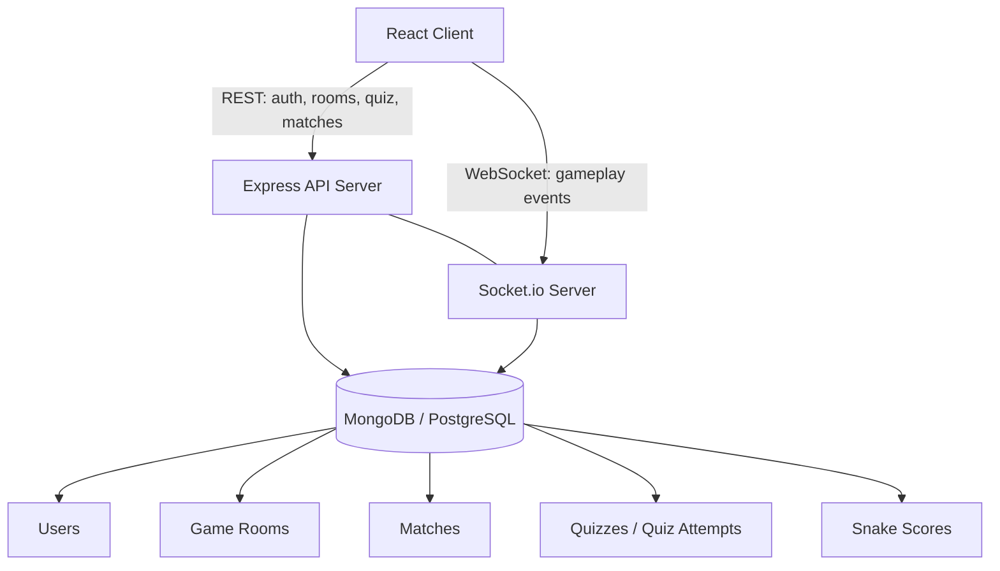

# 🎮 GameSphere

**A real-time, full-stack multiplayer & single-player gaming platform**

GameSphere lets players authenticate, create or join game lobbies via room codes, compete head-to-head over WebSockets, play classic single-player arcade games, and track their stats on global leaderboards.

[](https://game-sphere-three.vercel.app/)
[](https://github.com/Vijay-Prakash15/Game-Sphere)
[]()

**🔗 Live App:** [game-sphere-three.vercel.app](https://game-sphere-three.vercel.app/)
**📦 Repository:** [Vijay-Prakash15/Game-Sphere](https://github.com/Vijay-Prakash15/Game-Sphere)

---

## 📋 Table of Contents

- [Overview](#-overview)
- [Architecture](#️-architecture)
- [Tech Stack](#-tech-stack)
- [Games & Mechanics](#-games--mechanics)
  - [Points System](#overall-points-system-all-games)
  - [Tic Tac Toe](#1-tic-tac-toe)
  - [Rock Paper Scissors](#2-rock-paper-scissors)
  - [Guess the Number](#3-guess-the-number)
  - [Quiz](#4-quiz-single-player)
  - [Snake](#5-snake-single-player)
- [Database Schema](#-database-schema)
- [Real-Time Communication (WebSocket Events)](#-real-time-communication-websocket-events)
- [REST API Reference](#-rest-api-reference)
- [Configuration & Constants](#️-configuration--constants)
- [Security Considerations](#-security-considerations)
- [Testing Checklist](#-testing-checklist)
- [Delivery Roadmap](#️-delivery-roadmap)
- [Future Enhancements](#-future-enhancements)
- [Getting Started](#-getting-started)
- [Author](#-author)

---

## 🧭 Overview

GameSphere combines competitive PvP gameplay with solo arcade experiences in a single platform:

- **Real-time PvP**: Tic Tac Toe, Rock Paper Scissors, and Guess the Number, played over WebSockets with room-code based matchmaking.
- **Single-player**: A category/difficulty-based Quiz engine and a classic Snake arcade game.
- **Persistent profiles**: Every match, quiz attempt, and Snake run is recorded against a user profile, feeding global leaderboards and per-game statistics.
- **Best-of-3 format**: All PvP games share one unified scoring model — first to 2 round wins takes the match.

---

## 🏗️ Architecture

GameSphere follows a split architecture with a real-time layer sitting alongside a traditional REST API:



**Design principles:**

| Principle | Implementation |
|---|---|
| Server-authoritative gameplay | All moves, timers, and win conditions are validated server-side — the client never decides outcomes. |
| Separation of concerns | REST handles account/lobby setup; WebSockets handle only live gameplay events. |
| Stateless auth | JWT tokens verified on both REST requests and WebSocket connection handshakes. |
| Ephemeral lobbies | Game rooms use a TTL (`expiresAt`) so abandoned rooms are automatically cleaned up. |

---

## 🛠️ Tech Stack

| Layer | Technology |
|---|---|
| Frontend | React + Socket.io Client |
| Backend | Node.js + Express + Socket.io Server |
| Database | MongoDB (or PostgreSQL) |
| Auth | JWT (JSON Web Tokens) + bcrypt password hashing |
| Hosting | Vercel (frontend) |

---

## 🎮 Games & Mechanics

### Overall Points System (All Games)

All PvP games share a unified **Best-of-3** scoring model:

- 1 point = 1 round win
- First player to **2 points** wins and closes the match immediately (no need to play a 3rd round if it's already 2–0)
- Final results are displayed as `Player A Wins 2-0` or `Player A Wins 2-1`

---

### 1. Tic Tac Toe

| Property | Value |
|---|---|
| Players | 2 |
| Format | Best-of-3 rounds |
| Move Time Limit | 5 seconds |

**Flow:** Players alternate placing X/O on a 3×3 grid. A round ends on 3-in-a-row (win), a full board (draw), or a move timeout (opponent auto-wins the round). Roles/symbols swap between rounds; the match ends the moment either player reaches 2 points.

**Validation rules:**
- Move must target a valid, empty cell
- Move must be submitted within 5 seconds (enforced server-side)
- Invalid moves are rejected and the timer restarts
- The timer pauses while waiting on the opponent

---

### 2. Rock Paper Scissors

| Property | Value |
|---|---|
| Players | 2 |
| Format | Best-of-3 rounds |
| Choice Time Limit | 5 seconds |

**Flow:** Both players submit Rock/Paper/Scissors simultaneously within a 5-second window. The UI shows "Waiting for opponent…" until both choices are in (or the timer expires), then choices are revealed together — no partial reveals are ever sent to the client.

**Validation rules:**
- Server records both choices independently; a missed choice is a forfeit (opponent wins the round)
- Same choice from both players = draw, no points awarded
- R beats S, S beats P, P beats R

---

### 3. Guess the Number

| Property | Value |
|---|---|
| Players | 2 (roles alternate each round) |
| Format | Best-of-3 rounds |
| Max Guesses | 3 per round |
| Guess Time Limit | 5 seconds |

**Flow:** One player (the *Picker*) secretly selects a number between 1–100. The other player (the *Guesser*) gets up to 3 attempts, receiving a `"Too high"` / `"Too low"` hint after each incorrect guess. A correct guess within 3 attempts wins the round for the Guesser; exhausting all 3 without success wins the round for the Picker.

**Roles swap every round** — e.g. Player A picks in Round 1, Player B picks in Round 2, and Round 3 (if needed) reverts to Player A.

**Validation rules:**
- Picker's number must be an integer between 1–100
- Guesser's guess must be an integer between 1–100, submitted within 5 seconds
- Hints are strictly `"Too high"` / `"Too low"` — the actual number is never revealed early
- A missed timer counts as a wasted guess attempt

---

### 4. Quiz (Single Player)

| Property | Value |
|---|---|
| Players | 1 |
| Question Time Limit | 45 seconds |
| Difficulty Levels | Easy / Medium / Hard |
| Categories | DSA, Aptitude, Web Dev |

**Flow:** The player selects a category and difficulty, then answers 10–15 shuffled multiple-choice questions (4 options each) drawn from a pool of 100+ questions. Each question must be answered within 45 seconds or it's automatically marked incorrect. The final score is calculated as `(Correct / Total) × 100`.

**Scoring bands:**

| Score Range | Rating |
|---|---|
| 80–100% | Excellent |
| 60–79% | Good |
| 40–59% | Average |
| 0–39% | Poor |

**Validation rules:**
- 45-second timer enforced server-side
- No re-attempts once an answer is submitted
- Correct answers are **never** included in the question payload sent to the client — only revealed via the scoring response after submission

---

### 5. Snake (Single Player)

| Property | Value |
|---|---|
| Players | 1 |
| Format | Endless, until death |
| Controls | Arrow keys / WASD |

**Flow:** The snake starts at the center of the board with a length of 3. Eating food grows the snake by 1 segment and awards +10 points, spawning new food. The game ends when the snake collides with a wall or itself, and the final score is persisted to the player's profile.

**Planned enhancement:** progressive difficulty — speed increases every 5 food items eaten.

---

## 🗄️ Database Schema

<details>
<summary><strong>users</strong></summary>

```js
{
  _id: UUID,
  email: "player@example.com",
  username: "player_123",
  passwordHash: "bcrypt_hash",
  createdAt: ISODate,

  totalMatches: 45,
  totalWins: 28,
  totalLosses: 17,

  stats: {
    tictactoe: { wins: 10, losses: 5, totalRounds: 30 },
    rockpaperscissors: { wins: 8, losses: 7, totalRounds: 30 },
    guessNumber: { wins: 10, losses: 5, totalRounds: 30 },
    quiz: { totalAttempts: 12, avgScore: 78.5 },
    snake: { bestScore: 240 }
  },

  avatar: "avatar_url",
  lastLogin: ISODate
}
```
</details>

<details>
<summary><strong>gameRooms</strong></summary>

```js
{
  _id: UUID,
  code: "A7K9M2",
  creatorId: UUID_ref_users,
  gameType: "tic-tac-toe" | "rock-paper-scissors" | "guess-number",

  players: [{ userId: UUID, joinedAt: ISODate, ready: true }],

  status: "waiting" | "in_progress" | "completed",
  currentRound: 1 | 2 | 3,

  p1Score: 0,
  p2Score: 0,

  createdAt: ISODate,
  expiresAt: ISODate,     // TTL: room auto-deleted if expired
  completedAt: ISODate    // optional
}
```
</details>

<details>
<summary><strong>matches</strong> — one record per completed 3-round game</summary>

```js
{
  _id: UUID,
  roomId: UUID_ref_gameRooms,
  gameType: "tic-tac-toe" | "rock-paper-scissors" | "guess-number",

  player1Id: UUID,
  player2Id: UUID,

  rounds: [
    { roundNumber: 1, player1Move: "X", player2Move: "O", winner: "player1", duration: 45 },
    { roundNumber: 2, player1Move: "X", player2Move: "O", winner: "player1", duration: 38 },
    { roundNumber: 3, player1Move: "O", player2Move: "X", winner: "player1", duration: 42 }
  ],

  finalWinner: "player1" | "player2" | "draw",
  player1Score: 2,
  player2Score: 1,

  totalDuration: 125,      // seconds
  completedAt: ISODate,
  createdAt: ISODate
}
```
</details>

<details>
<summary><strong>quizzes</strong></summary>

```js
{
  _id: UUID,
  category: "DSA" | "Aptitude" | "WebDev",
  difficulty: "easy" | "medium" | "hard",

  question: "What is time complexity of binary search?",
  options: ["O(1)", "O(log n)", "O(n)", "O(n log n)"],
  correctAnswer: 1,    // index of correct option

  explanation: "Binary search halves the search space each time...",

  createdAt: ISODate,
  updatedAt: ISODate
}
```
</details>

<details>
<summary><strong>quizAttempts</strong></summary>

```js
{
  _id: UUID,
  userId: UUID,
  category: "DSA",
  difficulty: "medium",

  questions: [
    { quizId: UUID, selectedAnswer: 1, isCorrect: true, timeTaken: 23 },
    { quizId: UUID, selectedAnswer: 2, isCorrect: false, timeTaken: 45 }
  ],

  totalCorrect: 9,
  totalQuestions: 12,
  score: 75,           // percentage

  startedAt: ISODate,
  completedAt: ISODate
}
```
</details>

<details>
<summary><strong>snakeScores</strong></summary>

```js
{
  _id: UUID,
  userId: UUID,
  score: 240,
  foodEaten: 24,
  duration: 185,        // seconds
  playedAt: ISODate
}
```
</details>

---

## 📡 Real-Time Communication (WebSocket Events)

### Client → Server

| Event | Payload | Response |
|---|---|---|
| `create-room` | `{ gameType }` | `{ roomCode, roomId, expiresAt }` |
| `join-room` | `{ code, userId }` | `{ roomId, players, gameType }` or `{ error }` |
| `make-move` *(Tic Tac Toe)* | `{ roomId, round, position, player }` | `{ success, board, opponent_received }` |
| `submit-choice` *(RPS)* | `{ roomId, round, choice: "R" \| "P" \| "S" }` | `{ success, waiting_for_opponent }` |
| `submit-guess` *(Guess Number)* | `{ roomId, round, guess }` | `{ success, hint: "Too low" \| "Too high" \| "Correct" }` |

### Server → Client (Broadcast)

| Event | Payload |
|---|---|
| `opponent-joined` | `{ opponent: { userId, username } }` |
| `game-started` | `{ round, gameType, youAre }` |
| `opponent-move` | `{ round, position, board }` |
| `round-result` | `{ round, winner, player1Score, player2Score, nextRoundStartsIn }` |
| `match-result` | `{ finalWinner, p1Score, p2Score, matchId, reward }` |
| `opponent-left` | `{ message: "Opponent disconnected. You win by default." }` |

---

## 🔌 REST API Reference

### Authentication

| Method | Endpoint | Body | Response |
|---|---|---|---|
| `POST` | `/api/auth/register` | `{ email, password, username }` | `{ userId, token, message }` |
| `POST` | `/api/auth/login` | `{ email, password }` | `{ userId, token, user }` |
| `POST` | `/api/auth/logout` | — | `{ message }` |

### User Profile

| Method | Endpoint | Body | Response |
|---|---|---|---|
| `GET` | `/api/user/profile/:userId` | — | `{ userId, email, username, stats, recentMatches }` |
| `PUT` | `/api/user/profile/:userId` | `{ username, avatar }` | `{ message }` |

### Game Rooms *(REST for setup, WebSocket for live play)*

| Method | Endpoint | Body | Response |
|---|---|---|---|
| `POST` | `/api/rooms/create` | `{ gameType }` | `{ roomCode, roomId, expiresAt }` |
| `GET` | `/api/rooms/:roomId` | — | `{ roomId, gameType, players, status, expiresAt }` |
| `POST` | `/api/rooms/:roomId/join` | `{ userId }` | `{ message, roomId, opponent }` |

### Match History

| Method | Endpoint | Response |
|---|---|---|
| `GET` | `/api/matches/user/:userId` | Array of `{ matchId, opponent, gameType, result, score, playedAt }` |
| `GET` | `/api/matches/:matchId` | `{ matchId, players, gameType, rounds, finalWinner, completedAt }` |

### Quiz

| Method | Endpoint | Body | Response |
|---|---|---|---|
| `GET` | `/api/quiz/questions/:category/:difficulty` | — | Array of `{ quizId, category, difficulty, question, options }` *(no correct answer included)* |
| `POST` | `/api/quiz/submit` | `{ category, difficulty, answers: [{ quizId, selectedAnswer, timeTaken }] }` | `{ score, totalCorrect, totalQuestions, breakdown }` |

### Leaderboard

| Method | Endpoint | Response |
|---|---|---|
| `GET` | `/api/leaderboard/:gameType` | Array of `{ rank, username, wins, winRate, matchesPlayed }` |

---

## ⚙️ Configuration & Constants

```js
const GAME_CONFIG = {
  room: {
    roomCodeLength: 6,
    roomExpireMinutes: 1
  },
  tictactoe: {
    moveTimeLimitSeconds: 5,
    boardSize: 3,
    pointsPerWin: 1
  },
  rps: {
    choiceTimeLimitSeconds: 5,
    revealDelaySeconds: 1,
    pointsPerWin: 1
  },
  guessNumber: {
    guessTimeLimitSeconds: 5,
    maxGuessesPerRound: 3,
    numberMin: 1,
    numberMax: 100,
    pointsPerWin: 1
  },
  quiz: {
    questionTimeLimitSeconds: 45,
    maxQuestionsPerSession: 15,
    minQuestionsForScore: 10
  },
  snake: {
    pointsPerFood: 10,
    initialLength: 3,
    boardWidth: 400,
    boardHeight: 400
  },
  matchFormat: {
    pointsToWin: 2,     // first to 2 wins
    totalRounds: 3       // max rounds if needed
  }
};
```

---

## 🔒 Security Considerations

- **Server-side move validation** — the client is never trusted for outcomes; every move, guess, and choice is verified on the backend.
- **Enforced timers** — all time limits (5s moves, 45s quiz questions) are enforced server-side, not just visually on the client.
- **Salted room codes** — room codes are generated with a salt to prevent guessing/collision.
- **WebSocket authentication** — JWT tokens are verified on every WebSocket connection, not just on initial REST login.
- **Hidden quiz answers** — correct answers are never included in the question payload; they're only used server-side during grading.
- **Disconnect handling** — if a player disconnects mid-match, the opponent wins by default after a 30-second grace period.

---

## ✅ Testing Checklist

- [ ] Two players can join the same room via code
- [ ] Timer enforces 5-second limits in Tic Tac Toe
- [ ] RPS reveals only after both players have chosen, or on timeout
- [ ] Guess the Number correctly swaps picker/guesser roles each round
- [ ] Quiz enforces the 45-second per-question limit
- [ ] Points system correctly calculates round and match winners
- [ ] Best-of-3 closes immediately once a player reaches 2 points
- [ ] All completed games persist correctly to the database
- [ ] WebSocket reconnection works as expected
- [ ] Opponent disconnect triggers the correct default-win message

---

## 🗺️ Delivery Roadmap

| Phase | Weeks | Deliverable |
|---|---|---|
| **1. Foundation** | 1–2 | Users can create rooms, get codes, and join via code (infra only, no game logic) |
| **2. Tic Tac Toe** | 2–3 | Two players can play 3 rounds of Tic Tac Toe with a final result |
| **3. Rock Paper Scissors** | 3–4 | Two players can play 3 rounds of RPS |
| **4. Guess the Number** | 4–5 | Full guess game with correct role swapping |
| **5. Single-Player Games** | 5–6 | Quiz and Snake fully playable end-to-end |
| **6. Points System & Polish** | 6–7 | Fully playable MVP with points, leaderboard, animations, and error handling |

<details>
<summary>Expand full task breakdown</summary>

**Phase 1 — Foundation**
- Frontend setup (React + Socket.io client)
- Backend setup (Express + Socket.io server)
- Database setup (MongoDB/PostgreSQL)
- User authentication (JWT)
- Room creation & join (REST API)
- WebSocket connection initialization

**Phase 2 — Tic Tac Toe**
- 3×3 grid UI, turn-based move handling, WebSocket move sync
- 5-second move timer, win/draw detection, 3-round loop, match persisted to DB

**Phase 3 — Rock Paper Scissors**
- RPS UI, simultaneous move handling, "waiting for opponent" state
- Reveal logic, win calculation, draw handling, 3-round loop, match persisted to DB

**Phase 4 — Guess the Number**
- Picker/guesser input screens, 3-guess limit, hint logic
- Role-swap logic, win detection, 3-round loop, match persisted to DB

**Phase 5 — Single-Player Games**
- *Quiz:* category/difficulty selection, question loader + shuffling, 45s timer, scoring, attempt persisted to DB
- *Snake:* canvas setup, movement logic, keyboard controls, food spawning, collision detection, score tracking, score persisted to DB

**Phase 6 — Points System & Polish**
- Points calculation across all games, round-by-round display, best-of-3 closing logic
- Final leaderboard screen, user stats updates, UI animations, loading states, error handling

</details>

---

## 🚀 Future Enhancements

- [ ] Multiplayer leaderboard
- [ ] Friend system
- [ ] Achievements / badges
- [ ] Ranked mode
- [ ] AI opponent for practice
- [ ] In-game chat
- [ ] Tournament mode
- [ ] Mobile app

---

## 🏁 Getting Started

```bash
# Clone the repository
git clone https://github.com/Vijay-Prakash15/Game-Sphere.git
cd Game-Sphere

# Install dependencies (client & server)
npm install

# Configure environment variables
# (JWT secret, database connection string, client/server ports, etc.)
cp .env.example .env

# Run the development servers
npm run dev
```

> ⚠️ **Note:** This project is currently in the **Pre-Development Planning** stage — the setup steps above assume the standard structure described in this specification and may need to be adapted as the codebase evolves.

---

## 👤 Author

**Vijay Prakash Gupta**
🔗 [GitHub Profile](https://github.com/Vijay-Prakash15)

---

<p align="center">Made with ❤️ for real-time multiplayer fun</p>